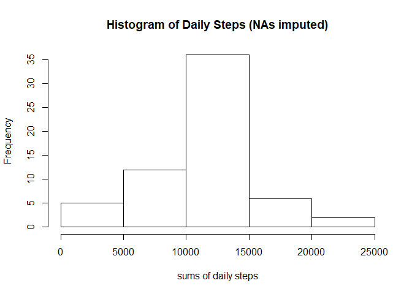

###Set up
This sets knitr options, display options, and loads the needed libraries.


```r
knitr::opts_chunk$set(echo = TRUE)
options(scipen=1, digits=2)
library(dplyr)
library(ggplot2)
```

###Loading and preprocessing the data
First I unzipped the activity file and read it. Next I converted the data in the "Date" column to date class.


```r
activity<-read.csv(unzip("activity.zip"))
activity$date<-as.Date(activity$date, "%Y-%m-%d")
```

###What is the mean number of steps taken per day?

I grouped the activity dataframe by date, then summarized it to create a new dataframe that just included the date and sum of steps for that date (with no NAs). Finally I plotted a histogram of this summed step data and calculated the mean and median of the the set of summed steps.


```r
activity<-group_by(activity, date)
steps_by_date<-summarize(activity, sum_steps=sum(steps, na.rm=TRUE))
hist(steps_by_date$sum_steps, xlab = "sums of daily steps", main="Histogram of Daily Steps (NAs omitted)")
```

<!-- -->

```r
mean_steps<-mean(steps_by_date$sum_steps)
median_steps<-median(steps_by_date$sum_steps)
```

The mean is 9354.23, and the median is 10395.

###What is the average daily activity pattern?

I ungrouped the data and then grouped it by interval, and summarized that new dataframe by mean steps. 
Then I plotted the average step count over all days for each interval and plotted the time series. 
Finally I found the interval with the highest average steps. 

```r
activity<-group_by(ungroup(activity), interval)
steps_by_interval<-summarize(activity, mean_steps=mean(steps, na.rm=TRUE))
plot(steps_by_interval$interval, steps_by_interval$mean_steps, type="l", xlab="interval", ylab="average steps", main = "Steps per Interval Averaged over all Days")
```

<!-- -->

```r
max_interval=steps_by_interval$interval[which.max(steps_by_interval$mean_steps)]
activity<-ungroup(activity) 
```
The interval with the maximum number of average steps is interval 835.

###Imputing missing values

First I calculated the rows that contain NAs.


```r
na_rows<-sum(is.na.data.frame(activity))
```

There are 2304 rows that contain NAs.  

####Method of Imputing:

I decided to impute the missing values based on the average of the steps for that interval. This is possible because there is at least one non-NA step count for each interval. I subsetted the interval values to only include the intervals for which there was and NA. 


```r
activity2<-activity
activity2<-left_join(activity2, steps_by_interval, by="interval")
activity2$replace<-is.na(activity2$steps)
activity2$steps[activity2$replace]<-activity2$mean_steps[activity2$replace]
activity2<-activity2[,1:3]
```


I recalculated the histogram and measures of center for the data with imputed values. 

```r
activity2<-group_by(activity2, date)
steps_by_date2<-summarize(activity2, sum_steps=sum(steps, na.rm=TRUE))
hist(steps_by_date2$sum_steps, xlab = "sums of daily steps", main="Histogram of Daily Steps (NAs imputed)")
```

<!-- -->

```r
mean_steps2<-mean(steps_by_date2$sum_steps)
median_steps2<-median(steps_by_date$sum_steps)
```

The mean is 10766.19, and the median is 10395. The histogram and measures of center have all shifted right, meaning that imputing the values ended up increasing them on average.

###Are there differences in activity patterns between weekdays and weekends?

I made a new dataframe that included the imputed values and also a column that had two levels: "weekday" and "weekend" which calculated from the date columns. 


```r
activity3<-mutate(activity2, daytype=ifelse(weekdays(date) =="Saturday" |weekdays(date)== "Sunday", "weekend", "weekday"))
activity3$daytype<-factor(activity3$daytype)
```

Then I grouped the data by daytype and interval and plotted the average steps per interval over all the weekday days and all the weekend days. 


```r
activity3<-group_by(activity3, daytype, interval)
steps_by_interval3<-summarize(activity3, mean_steps=mean(steps))
ggplot(data=steps_by_interval3, aes(x=interval, y=mean_steps, ylab= "mean steps")) + geom_line() +facet_grid(daytype~.)
```

<!-- -->
